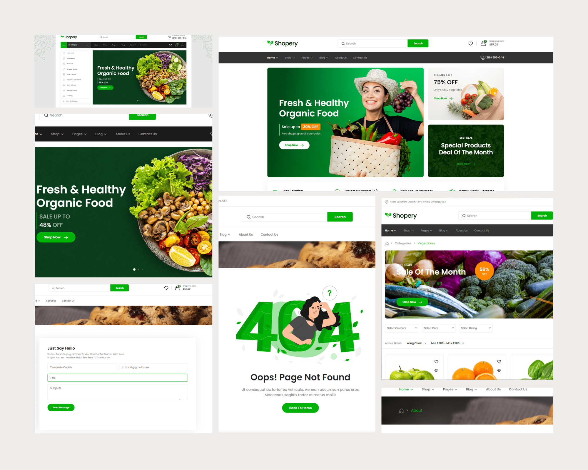

# Project - Shopery — eCommerce

---

Multipage with Ultra responsive 21 pages Layout . Have 5 Homepage , 2 Shop Pages . Sign-in, Account, User Dashboard , Blogs etc. This is Our Product  for Envato market . All Designs & Development by templatecookie & Zakir Soft. 

# Project Sitemap

---

- Homepages
    - Homepage 01
    - Homepage 02
    - Homepage 03
    - Homepage 04
    - Homepage 05
- Shop
    - Shope 01
    - Shope 02
- Dashboard
    - User Profile
    - Order History
    - Wishlist
    - Shopping Cart
    - Settings
- About
- Product Details
- Blogs
    - Blog List
    - Single Blog
- Contact
- Sign in
- Create Account
- Faqs
- Error

# Folder Structure

---

- dist
    - plugins
        - css
            - bvselect.css
            - swiper-bundle.min.css
            - venobox.css
        - js
            - bvselect.js
            - countfect.min.js
            - jquery.min.js
            - jquery.syotimer.min.js
            - swiper-bundle-min.js
            - venobox.min.js

    - main.css
    - main.js
- src
    - scss
        - abstracts
            - _functions.scss
            - _variables.scss
        - base
            - _reset.scss
            - _typography.scss
        - components
            - _accordion.scss
            - _arrow.scss
            - _bar.scss
            - _brands.scss
            - _buttons.scss
            - _cards.scss
            - _countdown.scss
            - _counter.scss
            - _counter-btn.scss
            - _dots.scss
            - _dropdown.scss
            - _form.scss
            - _navigation.scss
            - _pagination.scss
            - _progress-bar.scss
            - _social-icons.scss
        - Layout
            - _banner.scss
            - _blog-sidebar.scss
            - _breadcrumb.scss
            - _category.scss
            - _contact-form.scss
            - _footer.scss
            - _header.scss
            - _hero.scss
            - _loader.scss
            - _maps.scss
            - _mobile-menu.scss
            - _newsletter.scss
            - _newsletter-pop.scss
            - _products.scss
            - _product-view.scss
            - _sales-banner.scss
            - _section.scss
            - _shop-sidebar.scss
        - Pages
            - _about.scss
            - _account.scss
            - _blogs.scss
            - _contact.scss
            - _dashboard.scss
            - _error.scss
            - _faq.scss
            - _home.scss
            - _presentation.scss
            - _product-details.scss
            - _shop.scss
            - _single-blog.scss
        - main.scss
- js
    - main.js
- images
    - banner
    - blogs
    - brand-icon
    - brands
    - categories
    - favicon
    - icons
    - instagram
    - members
    - news
    - overlay
    - product-details
    - products
    - pview
    - user
- 404.html
- about.html
- account-setting.html
- blog-list.html
- checkout.html
- contact.html
- create-account.html
- faq.html
- home-02.html
- home-03.html
- home-04.html
- home-05.html
- index.html
- order-details.html
- order-history.html
- presentation.html
- product-details.html
- shop-01.html
- shop-02.html
- shopping-cart.html
- sign-in.html
- single-blog.html
- sitemap.html
- styleguide.html
- user-dashboard.html
- wishlist.html

# Webpack Boilerplate
This repository contains Webpack and SCSS boilerplate code to quickly get started on building a webpage following a simplified version of SASS (7-1 pattern).

## Project Setup
### Installing
Run `npm install` to install all the dependencies this project needs. 

### Running the app
Run `npm run dev`. Your browser should automatically open a new tab where you can see your app.
*Note :* live reload is enabled so just modify your files and it will be reflected on the app instantly.

### Building the app
Run `npm run build`. It will automatically add vendor prefixes to CSS rules and compress all your `.scss` files into one `style.css` file located in your `dist` folder.

## SASS folder structure
It contains these folder and files : 

- `abstracts` : functions, variables
- `base` : reset, typography,
- `components` : buttons, form
- `layout` : footer, header, nav, breadcrumb
- `pages` : contact, home,
- `themes` : theme
- `vendors` : bootstrap, fontawesome

## Included Framework and Libraries
- `fontawesome` - Font Library

## Webpack Dependencies
- Webpack
- Babel
- File Loader
- CSS Loader
- Node SASS
- SASS Loader
- Post CSS 
- Autoprefixer
- Purge CSS
- Mini CSS Extractor Plugin

# Developed HTML Version

> **Sheikh Rashed**
